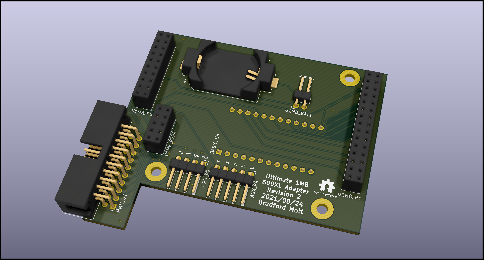
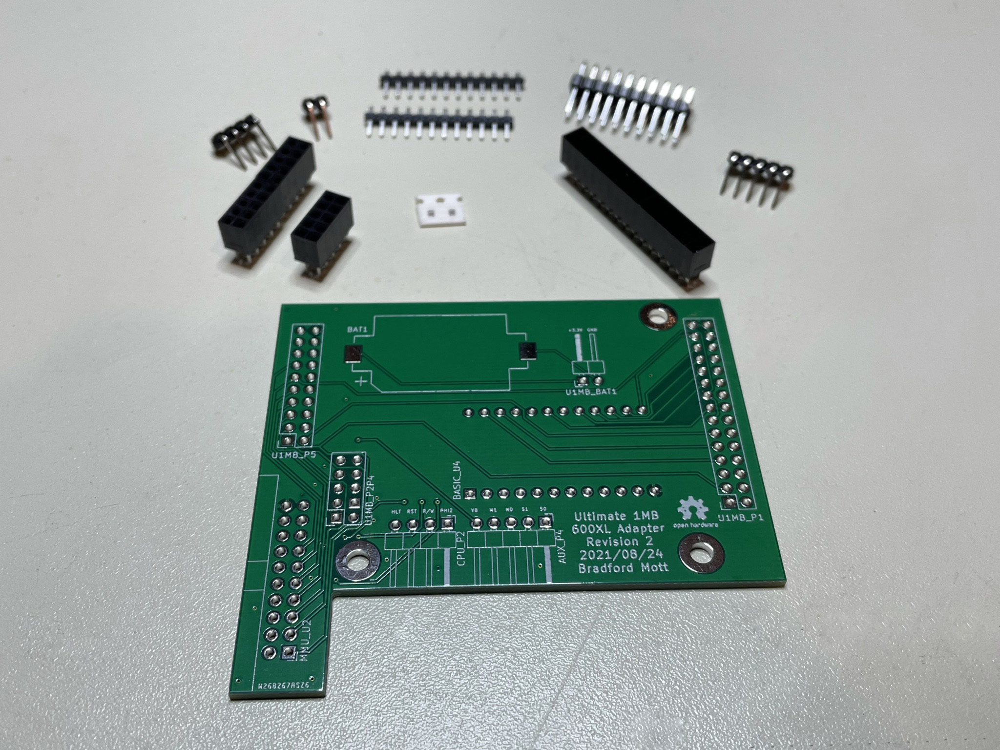
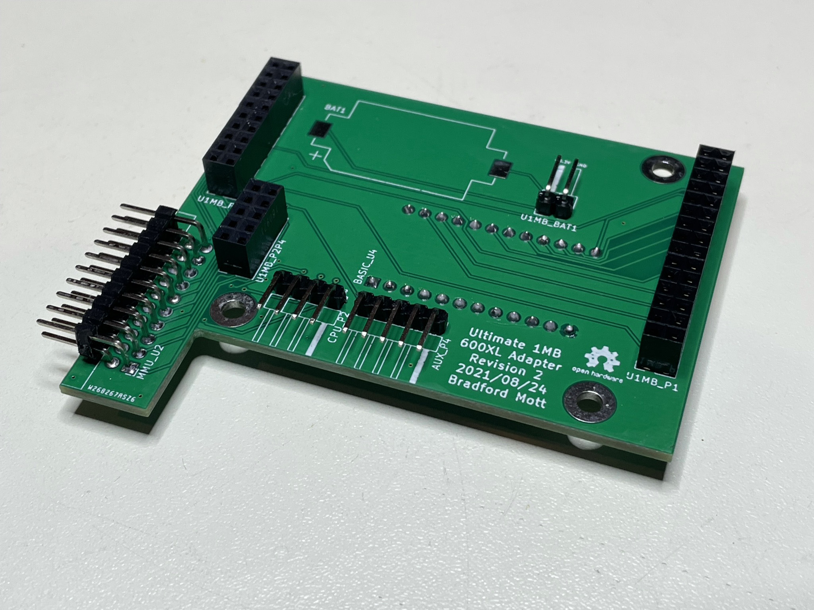
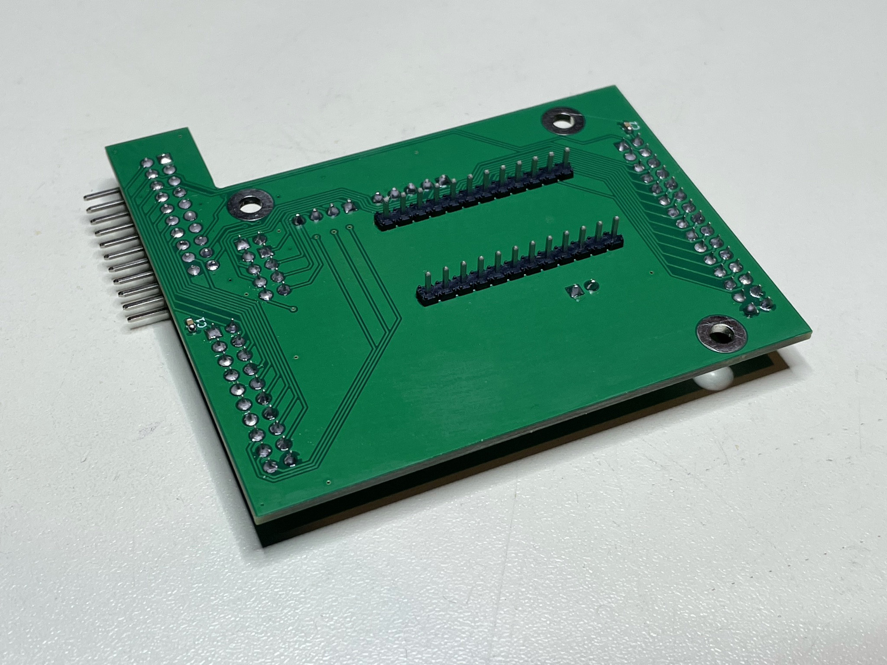
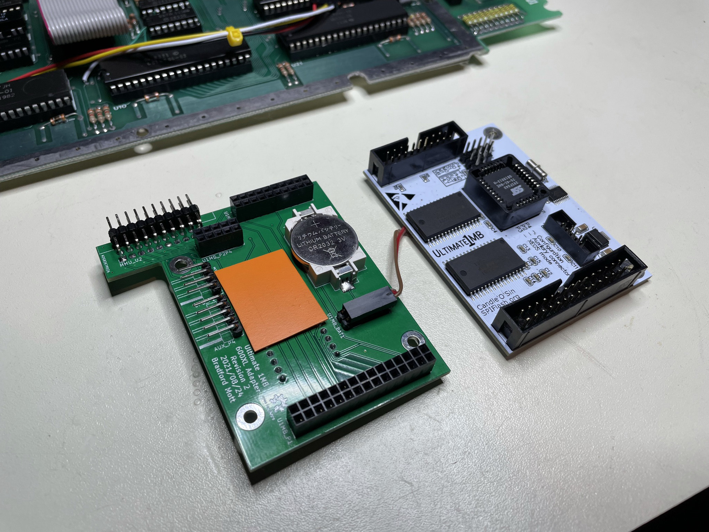
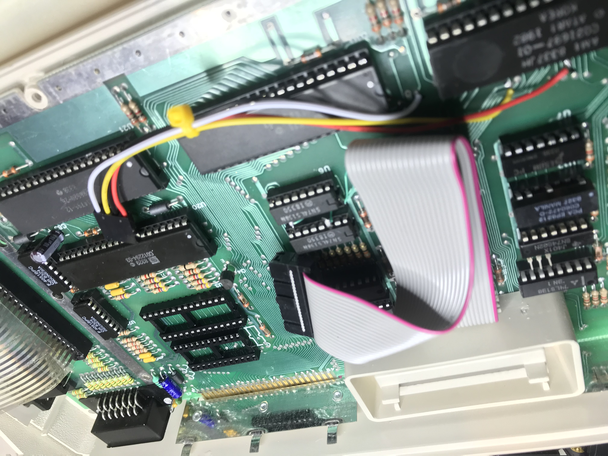
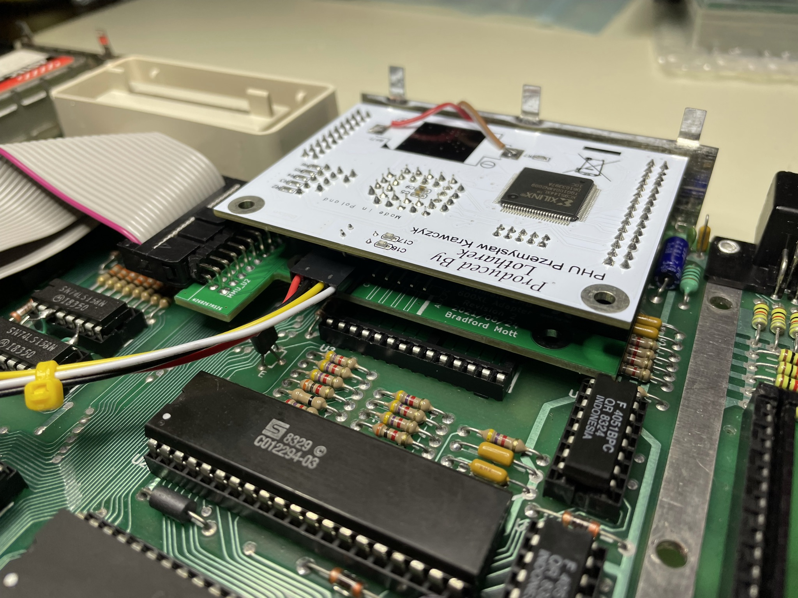
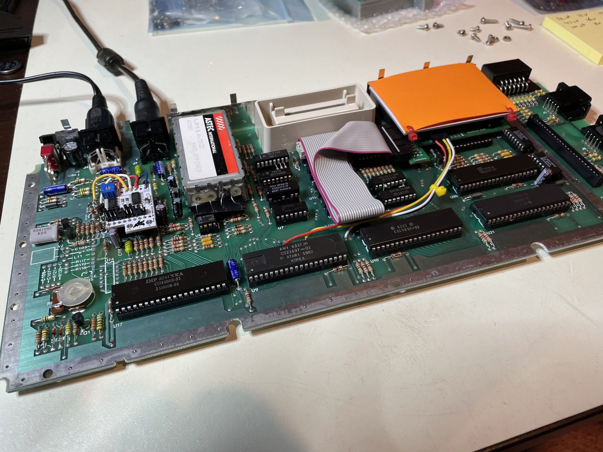
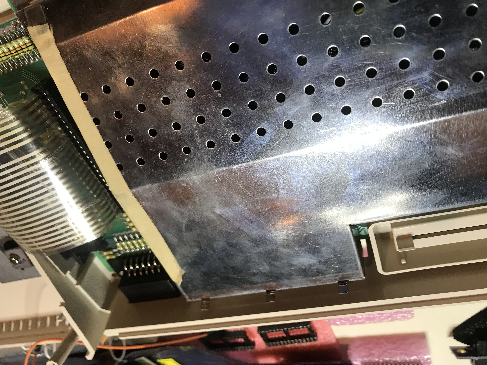

# Ultimate 1MB 600XL Adapter
The Ultimate 1MB 600XL Adapter is an open hardware PCB that helps with installing an Ultimate 1MB upgrade into an Atari 600XL computer. The [Ultimate 1MB](https://lotharek.pl/productdetail.php?id=56) is a popular upgrade for Atari 8-bit computers, which expands the system's memory to 1MB of RAM, offers a selectable flash memory-based ROM, and includes a Real Time Clock module. Prior to installing an Ultimate 1MB into an Atari 600XL computer, the system must be upgraded to 64KB of RAM (stock 600XLs only contain 16KB of RAM). There are several options for [upgrading a 600XL to 64KB](https://www.mathyvannisselroy.nl/xl600k64.htm).

The Ultimate 1MB 600XL Adapter allows the Ultimate 1MB to be installed in an Atari 600XL without any modifications to the case or motherboard (beyond soldering fours wires required by the Ultimate 1MB) and enables the RF shielding to be retained, if desired. Retaining the RF shielding requires relocating the coin cell battery holder from the Ultimate 1MB board to the Ultimate 1MB 600XL Adapter board.

## Components
In addition to an Ultimate 1MB and an Ultimate 1MB 600XL Adapter PCB, you'll need the following components to complete the build:

* (1) 2x5 10 Pos Receptacle (DigiKey A32955-ND; 6.73mm height) (U1MB_P2P4)
* (1) 2x10 20 Pos Receptacle (DigiKey A26490-ND; 6.73mm height) (U1MB_P5)
* (1) 2x15 30 Pos Receptacle (DigiKey A26494-ND; 6.73mm height) (U1MB_P1)
* (2) 12 Pin Header (DigiKey SAM1101-12-ND; low profile) (BASIC_U4)
* (1) 2 Pin Right Angle Header (U1MB_BAT1)
* (1) 4 Pin Right Angle Header (CPU_P2)
* (1) 5 Pin Right Angle Header (AUX_P4)
* (1) 2x10 20 Pin Right Angle Header (MMU_U2)
* (2) 0.1UF 25V Cap 0603 (DigiKey 732-7989-1-ND) (C1 & C2). (These can be skipped.)

If you would like to retain the RF shielding then the 2x5, 2x10, and 2x15 receptacles that the Ultimate 1MB upgrade plugs into should be no more than 6.73mm tall. In addition, a pair of low profile pin headers must be used on the adapter to plug into the 600XL's BASIC socket. The DigiKey part numbers listed above are versions that allow retaining the RF shielding. (To reduce the potential for damaging the BASIC socket, round pin headers such as Digikey part number SAM1000-12-ND are likely better than the square ones listed above; however, this hasn't been tested.) If you're not planning on retaining the RF shielding, then cheaper receptacles and pin headers can be utilized.

## Adapter Assembly
Here are all the parts and the PCB prior to building the Ultimate 1MB 600XL Adapter board.

Here are photos of the top and bottom of the Ultimate 1MB 600XL Adapter board after all of the components have been assembled.

Here we see the board after transplanting the coil cell battery holder from the Ultimate 1MB to the Ultimate 1MB Adapter board and running wires back to the Ultimate 1MB to provide power for its RTC. Be extra careful not to reverse the connection to the battery. We also see some insulation added on top of the BASIC pin headers to ensure that none of the pins accidentally touch the ROM socket pins on the Ultimate 1MB board when the two boards are plugged together.

## Adapter Installation
The Ultimate 1MB plugs directly on top of the Ultimate 1MB 600XL Adapter board once assembled. The adapter board can then be plugged into the 600XL's BASIC socket after removing both the BASIC and OS ROMs from the 600XL. The adapter board is designed such that the "jumper" settings on the motherboard for the type of BASIC ROM should not matter; however, the adapter board has only been tested using a stock NTSC 600XL.

You'll also need to connect the MMU cable and other motherboard signals to the adapter board like they are in a standard Ultimate 1MB installation. 

If you're retaining the RF shielding then you'll need to ensure the top of the Ultimate 1MB is insulated from the RF shield. A small piece of plastic attached to the board should work fine.

## Acknowledgements
* SukkoPera for the [DIP-24_W15.24mm-Notch KiCad foorprint](https://github.com/SukkoPera/Open2327RomAdapter/) which is used to provide a better 3D preview of the Ultimate 1MB 600XL Adapter.
* Michael St. Pierre for the Ultimate 1MB socket schematics used in the [1088 XEL Mini-ITX Motherboard](https://ataribits.weebly.com/1088xel.html) which were referenced during the design of the Ultimate 1MB 600XL Adapter.

## License
Copyright (c) 2021 by Bradford W. Mott. This source describes Open Hardware and is licensed under the CERN-OHL-W v2.

You may redistribute and modify this source and make products using it under the terms of the CERN-OHL-W v2 or later (https:/cern.ch/cern-ohl). This source is distributed WITHOUT ANY EXPRESS OR IMPLIED WARRANTY, INCLUDING OF MERCHANTABILITY, SATISFACTORY QUALITY AND FITNESS FOR A PARTICULAR PURPOSE. Please see the CERN-OHL-W v2 for applicable conditions.

Source location: https://github.com/bwmott/U1MB600XL
